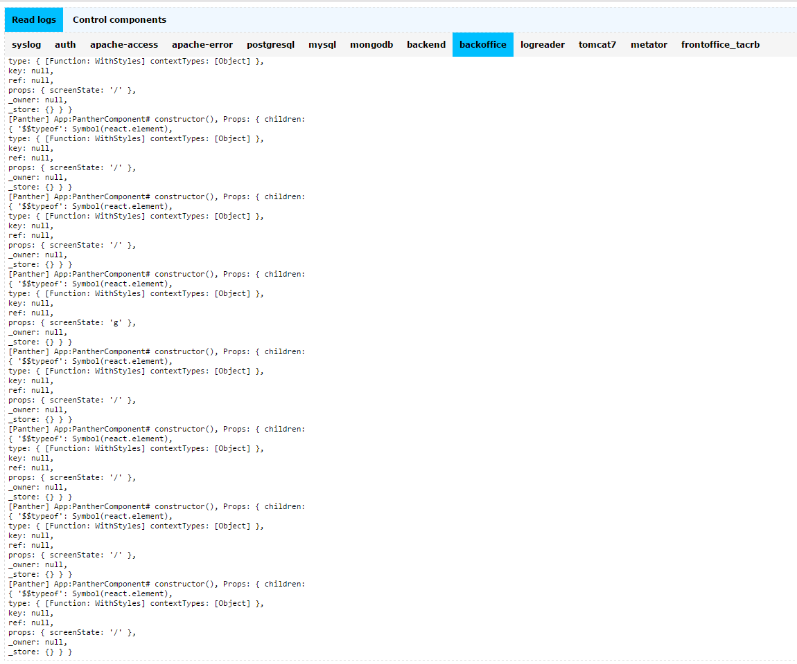
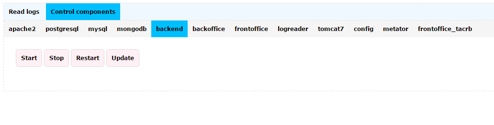

First Operations
################

The docker container contains custom application for browsing logs as well as updating the internal application. The application name is logreader. 
Logreader

Url: /logreader
Username: logreader
Password: &dm1n1str&t0r

This application has two tabs. First contains logs for all pieces of the solution while second one contains access to commands for updating configuration and applications of the docker container. Start, stop, restart and update of different applications residing in the container. 

